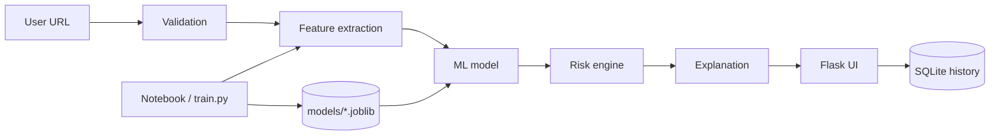

# Architecture

```mermaid
flowchart LR
 U[User URL] --> V[Validation] --> F[Feature extraction] --> M[ML model] --> R[Risk engine] --> E[Explanation] --> UI[Flask UI]
 N[Notebook / train.py] --> F
 N --> S[(models/*.joblib)] --> M
 UI --> H[(SQLite history)]
```
Training and inference import the same `src/feature_extraction.py`, so feature definitions and order are identical (`FEATURE_NAMES`).
